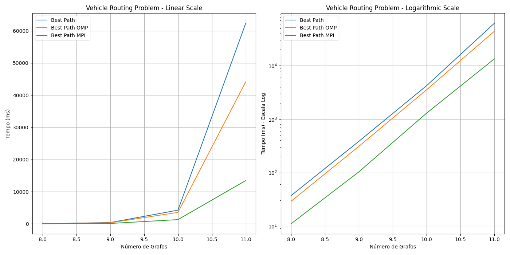

# 🚚 Vehicle Routing Problem (VRP)

[](https://choosealicense.com/licenses/mit/)
[](https://isocpp.org/)
[](https://www.openmp.org/)
[](https://www.open-mpi.org/)

A high-performance C++ implementation of solutions to the classic Vehicle Routing Problem (VRP), developed for the Supercomputing course at Insper 2024.1.



## 📋 Table of Contents

- [Project Overview](#-project-overview)
- [Repository Structure](#-repository-structure)
- [Algorithms & Approaches](#-algorithms--approaches)
- [Installation & Setup](#-installation--setup)
- [Running the Project](#-running-the-project)
- [Performance Analysis](#-performance-analysis)
- [Contributing](#-contributing)
- [Contact](#-contact)

## 🔍 Project Overview

The Vehicle Routing Problem (VRP) is a classic optimization problem that seeks to find the optimal routes for multiple vehicles to serve a set of customers, while minimizing the total distance traveled and respecting vehicle capacity constraints.

This project implements and compares multiple approaches to solve the VRP:

1. **Serial implementation** - A baseline exhaustive search algorithm
2. **Local parallel implementation** using OpenMP - Parallelization on a single machine
3. **Global parallel implementation** using MPI - Distributed computing across multiple nodes
4. **Heuristic approach** using Nearest Neighbor algorithm - A faster approximation

Each implementation is analyzed for performance, scalability, and solution quality across different problem sizes.

## 📁 Repository Structure

```
.
├── README.md                  # This documentation file
├── Supercomp_Projeto_2024.ipynb  # Jupyter notebook with project assignments
├── code/                      # Main source code directory
│   ├── base.cpp               # Base implementation and utilities
│   ├── base.h                 # Header file with function declarations
│   ├── global.cpp             # Serial global search implementation
│   ├── heuristic.cpp          # Heuristic (Nearest Neighbor) approach
│   ├── local_parallelization.cpp  # OpenMP parallel implementation
│   ├── global_parallelization.cpp # MPI distributed implementation
│   ├── global_parallelization.slurm # SLURM configuration for cluster execution
│   ├── execs/                 # Directory for compiled executables
│   ├── output/                # Output files from executions
│   └── python/                # Python scripts for visualization
├── docs/                      # Documentation and images
│   └── imgs/                  # Performance graphs and visualizations
├── grafo.txt                  # Input graph definition file
└── global_algorithm.cpp       # Standalone implementation of global algorithm
```

## 🧮 Algorithms & Approaches

### 1. Graph Loading & Data Structures

The VRP is represented using:
- A map of nodes (`map<int, int>`) where the key is the node ID and the value is the demand
- A map of distances (`map<pair<int, int>, int>`) to represent the distance between any two nodes

The graph is loaded from a text file with the following format:
```
<num_nodes>
<node_id> <demand>
...
<num_edges>
<node1> <node2> <distance>
...
```

### 2. Permutation Generation

Three approaches for generating all possible node permutations:

- **Serial:** Uses `std::next_permutation` to generate all permutations sequentially
- **Parallel:** Attempts to parallelize permutation generation using OpenMP
- **Optimized Parallel:** A hybrid approach that generates permutations serially then distributes them in parallel

### 3. Path Generation & Capacity Constraints

The algorithm filters permutations by:
- Ensuring routes start and end at the depot (node 0)
- Splitting routes when vehicle capacity would be exceeded
- Ensuring connections exist between consecutive nodes

### 4. Solution Approaches

#### Global Search (Exact Solution)
- Exhaustively evaluates all possible paths to find the global optimum
- Parallelized using both OpenMP (shared memory) and MPI (distributed memory)

#### Nearest Neighbor Heuristic
- Greedily selects the nearest unvisited node at each step
- Returns a fast approximate solution
- Implemented in both serial and parallel versions

## 🛠️ Installation & Setup

### Prerequisites

- C++ compiler with C++20 support
- OpenMP for parallel processing
- MPI for distributed computing
- SLURM workload manager (for cluster execution)

### Compilation

#### Basic Compilation
```bash
# Compile serial implementation
c++ -std=c++20 -o execs/global_search global.cpp base.cpp

# Compile heuristic implementation
c++ -std=c++20 -o execs/heuristic_search heuristic.cpp base.cpp
```

#### Parallel Compilation (OpenMP)
```bash
# Compile with OpenMP support
c++ -std=c++20 -fopenmp -o execs/local_parallelization local_parallelization.cpp base.cpp
```

#### Distributed Compilation (MPI)
```bash
# Compile with MPI support
mpic++ -std=c++20 -o execs/global_parallelization global_parallelization.cpp base.cpp
```

## 🚀 Running the Project

### Running Serial and OpenMP Versions
```bash
# Run serial global search
./execs/global_search

# Run OpenMP parallelized version
./execs/local_parallelization
```

### Running MPI Version Locally
```bash
# Run with 4 processes
mpirun -np 4 ./execs/global_parallelization
```

### Running on a SLURM Cluster
```bash
# Submit the job to the SLURM scheduler
sbatch global_parallelization.slurm
```

The SLURM configuration is as follows:
```bash
#!/bin/bash
#SBATCH --partition=espec
#SBATCH --nodes=4
#SBATCH --ntasks-per-node=1
#SBATCH --cpus-per-task=4
#SBATCH --mem=2G
#SBATCH --job-name=global_parallelization
#SBATCH --output=output/slurm-%j.out

mpirun ./execs/global_parallelization
```

## 📊 Performance Analysis

### Serial vs. Parallel Execution Time

The results show significant performance gains with parallelization, especially as the problem size increases:

- For N=9 nodes:
  - Serial: 384 ms
  - OpenMP Parallel: 309 ms (19.53% improvement)
  - MPI Distributed: 103 ms (73.43% improvement)

- For N=11 nodes:
  - Serial: 62,351 ms
  - OpenMP Parallel: 44,155 ms (29.18% improvement)
  - MPI Distributed: 13,443 ms (78.45% improvement)

### Solution Quality: Global vs. Heuristic

The heuristic approach provides faster solutions but with variable accuracy:

- For N=6: Global found a solution with cost 264, while Heuristic found 378 (30.30% worse)
- For N=10: Global found a solution with cost 846, while Heuristic found 1012 (19.61% worse)
- For some cases (N=5, N=11), both approaches found solutions of equal quality

For detailed performance graphs, see the [docs/imgs](docs/imgs/) directory.

## 🤝 Contributing

Contributions are welcome! Please feel free to submit a Pull Request.

1. Fork the project
2. Create your feature branch (`git checkout -b feature/amazing-feature`)
3. Commit your changes (`git commit -m 'Add some amazing feature'`)
4. Push to the branch (`git push origin feature/amazing-feature`)
5. Open a Pull Request

## 📧 Contact

Antônio Amaral Egydio Martins - [antonio.am@insper.edu.br](mailto:antonio.am@insper.edu.br)

Project Link: [https://github.com/AntonioEgydio/Vehicle-Routing-Problem](https://github.com/AntonioEgydio/Vehicle-Routing-Problem)