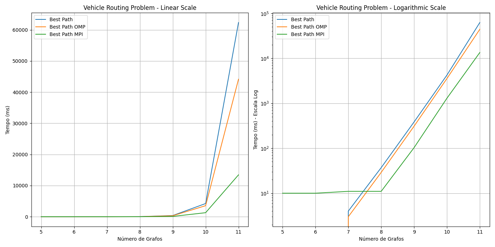
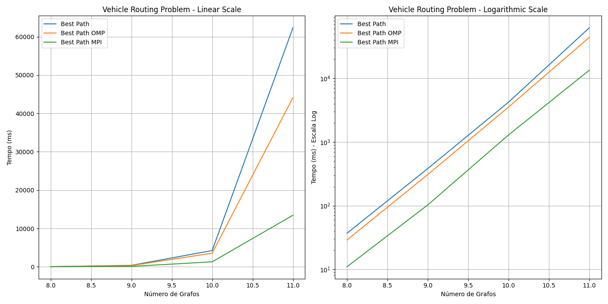
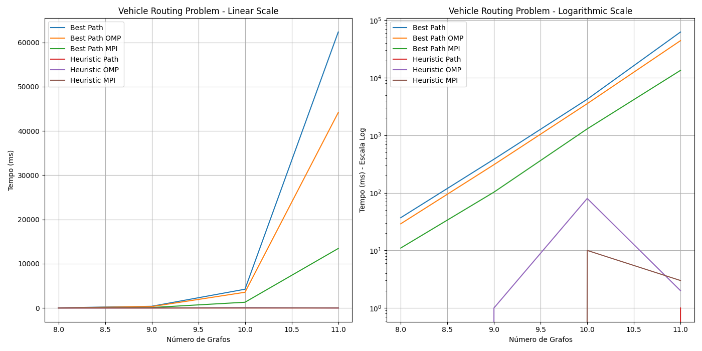
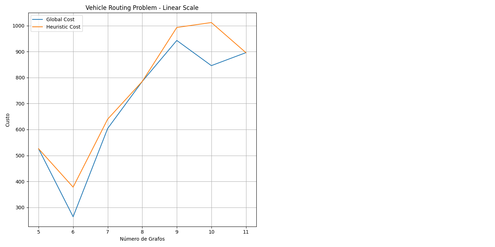

### Vehicle Routing Problem
#### Supercomputação - Insper 2024.1
#### Antônio Amaral Egydio Martins

### 1. Organização de Diretórios

A estrutura de diretórios para o projeto de Vehicle Routing Problem está organizada da seguinte forma:

```
.
├── README.md
├── Supercomp_Projeto_2024.ipynb
├── code
│   ├── base.cpp
│   ├── base.h
│   ├── execs
│   │   ├── global_parallelization
│   │   ├── global_search
│   │   ├── heuristic_search
│   │   └── local_parallelization
│   ├── global.cpp
│   ├── global_parallelization.cpp
│   ├── global_parallelization.slurm
│   ├── heuristic.cpp
│   ├── local_parallelization.cpp
│   ├── output
│   │   ├── N=10.out
│   │   ├── N=11.out
│   │   ├── N=5.out
│   │   ├── N=6.out
│   │   ├── N=7.out
│   │   ├── N=8.out
│   │   └── N=9.out
│   └── python
│       └── graph.py
├── docs
│   ├── imgs
│   │   └── timexn.png
│   └── report.md
├── global_algorithm.cpp
└── grafo.txt
```

- `README.md`: Contém informações gerais sobre o projeto, instruções de uso e dependências.
- `Supercomp_Projeto_2024.ipynb`: Notebook Jupyter com os enunciados das atividades e implementações.
- `code/`: Diretório que contém os códigos-fonte em C++ e Python, organizados em subdiretórios.
  - `base.cpp` e `base.h`: Arquivos de implementação base e cabeçalho.
  - `execs/`: Contém os executáveis gerados pelos diferentes métodos de busca.
    - `global_parallelization`: Executável para paralelização global.
    - `global_search`: Executável para busca global.
    - `heuristic_search`: Executável para busca heurística.
    - `local_parallelization`: Executável para paralelização local.
  - `global.cpp`: Código para a busca global.
  - `global_parallelization.cpp`: Código para a paralelização global.
  - `global_parallelization.slurm`: Script SLURM para execução de paralelização global.
  - `heuristic.cpp`: Código para a busca heurística.
  - `local_parallelization.cpp`: Código para a paralelização local.
  - `output/`: Diretório que contém os arquivos de saída das execuções.
    - `N=10.out`, `N=11.out`, `N=5.out`, `N=6.out`, `N=7.out`, `N=8.out`, `N=9.out`: Arquivos de saída para diferentes tamanhos de problema.
  - `python/graph.py`: Script em Python para geração de gráficos.
- `docs/`: Diretório que contém documentação e imagens.
  - `imgs/timexn.png`: Imagem utilizada no relatório.
  - `report.md`: Relatório do projeto.
- `global_algorithm.cpp`: Código para o algoritmo global.
- `grafo.txt`: Arquivo de entrada contendo a definição do grafo.

### 2. Executáveis

#### 2.1 Como Executar Arquivos

Para a execução dos arquivos, seguem-se as instruções abaixo:

1. **Executando C++**:

Abaixo está um exemplo de compilação utilizando clang++
```bash
clang++ -std=c++20 -o execs/local_parallelization local_parallelization.cpp base.cpp
c++ -std=c++20 -o execs/local_parallelization local_parallelization.cpp base.cpp
```

2. **Executando OMP**:

Para utilizar a biblioteca OMP é necessário compilar o arquivo com a flag `-fopenmp` e executar o arquivo com a flag `-fopenmp` também.

```bash
clang++ -std=c++20 -fopenmp -o execs/local_parallelization local_parallelization.cpp base.cpp
```

3. **Executando MPI**:

Para utilizar a biblioteca MPI é necessário compilar o arquivo com o comando `mpic++` e executar o arquivo com o comando `mpirun`.

```bash
mpic++ -std=c++20 -o execs/local_parallelization local_parallelization.cpp base.cpp
mpirun -np 4 execs/local_parallelization
```

No caso deste trabalho o MPI será executado utilizando o Slurm do cluster, com as seguintes configurações:

```bash
#!/bin/bash
#SBATCH --partition=espec
#SBATCH --nodes=4
#SBATCH --ntasks-per-node=1
#SBATCH --cpus-per-task=4
#SBATCH --mem=2G         
#SBATCH --job-name=global_parallelization
#SBATCH --output=output/slurm-%j.out  

mpirun ./execs/global_parallelization
```

### 3. Algoritmos

#### 3.1 Carregamento do Grafo

### 3. Algoritmos

#### 3.1 Carregamento do Grafo

Para a correta execução do problema de roteamento de veículos (Vehicle Routing Problem), é essencial carregar o grafo que representa a rede de nós e as distâncias entre eles. O algoritmo de carregamento do grafo foi implementado em C++ e está contido nos arquivos `base.cpp` e `base.h`.

##### Código `base.cpp`

O arquivo `base.cpp` contém a implementação da função `load_graph`, que é responsável por carregar os dados do grafo a partir de um arquivo de entrada. O código é apresentado abaixo:

```cpp
void load_graph(const std::string &filename, std::map<int, int> &nodes, std::map<std::pair<int, int>, int> &distances)
{
    std::ifstream infile(filename);
    if (!infile)
    {
        std::cerr << "Erro ao abrir o arquivo" << std::endl;
        return;
    }

    int num_nodes;
    infile >> num_nodes;

    nodes.clear();
    nodes[0] = 0;

    for (int i = 1; i < num_nodes; ++i)
    { // Start from 1 because the first node is the origin
        int id, pedido;
        infile >> id >> pedido;
        nodes[id] = pedido;
    }

    int num_edges;
    infile >> num_edges;

    distances.clear();
    int node1, node2, distance;
    for (int i = 0; i < num_edges; ++i)
    {
        infile >> node1 >> node2 >> distance;
        distances[{node1, node2}] = distance;
    }

    infile.close();
}
```

##### Código `base.h`

O arquivo `base.h` declara a função `load_graph`, permitindo que ela seja utilizada em outras partes do projeto. A declaração é apresentada abaixo:

```cpp
void load_graph(const std::string &filename, std::map<int, int> &nodes, std::map<std::pair<int, int>, int> &distances);
```

##### Descrição da Implementação

1. **Abertura do Arquivo**: A função começa tentando abrir o arquivo especificado pelo parâmetro `filename`. Se o arquivo não puder ser aberto, é exibida uma mensagem de erro e a função retorna sem realizar nenhuma operação adicional.

2. **Leitura do Número de Nós**: O número total de nós no grafo é lido do arquivo. Em seguida, o mapa `nodes` é limpo e inicializado com o nó de origem (nó 0) associado ao valor 0.

3. **Leitura dos Nós**: A função lê a identificação (ID) e a quantidade de pedidos (pedido) para cada nó (exceto o nó de origem) e armazena essas informações no mapa `nodes`.

4. **Leitura do Número de Arestas**: O número total de arestas no grafo é lido do arquivo. O mapa `distances` é então limpo.

5. **Leitura das Arestas**: Para cada aresta, a função lê os dois nós conectados (`node1` e `node2`) e a distância entre eles (`distance`), armazenando essas informações no mapa `distances`.

6. **Fechamento do Arquivo**: Após carregar todas as informações necessárias, o arquivo é fechado.

#### 3.2 Geração de Permutações

Para resolver o problema de roteamento de veículos, é fundamental gerar todas as permutações possíveis das localizações para explorar diferentes rotas. Abaixo são descritas três abordagens para gerar permutações: uma serial e duas paralelas, sendo a última uma versão otimizada.

##### Função `generatePermutations`

A função `generatePermutations` gera permutações de maneira serial. O código é apresentado abaixo:

```cpp
std::vector<std::vector<int>> generatePermutations(const std::map<int, int> &locations)
{
    std::vector<std::vector<int>> permutations;
    std::vector<int> indexes;

    for (const auto &pair : locations)
    {
        indexes.push_back(pair.first);
    }

    int n = indexes.size();
    int num_permutations = 1;
    for (int i = 1; i <= n; ++i)
    {
        num_permutations *= i;
    }

    for (int i = 0; i < num_permutations; ++i)
    {
        permutations.push_back(indexes);
        std::next_permutation(indexes.begin(), indexes.end());
    }

    return permutations;
}
```

Essa função itera sobre todas as permutações possíveis das localizações. Ela começa carregando as localizações em um vetor `indexes`, calcula o número total de permutações e, em seguida, utiliza a função `std::next_permutation` para gerar todas as permutações possíveis, armazenando cada uma no vetor `permutations`.

##### Função `generatePermutationsParallel`

A função `generatePermutationsParallel` tenta paralelizar o processo de geração de permutações utilizando OpenMP. O código é apresentado abaixo:

```cpp
std::vector<std::vector<int>> generatePermutationsParallel(const std::map<int, int> &locations)
{
    std::vector<std::vector<int>> permutations;
    std::vector<int> indexes;

    for (const auto &pair : locations)
    {
        indexes.push_back(pair.first);
    }

    int n = indexes.size();
    int num_permutations = 1;
    for (int i = 1; i <= n; ++i)
    {
        num_permutations *= i;
    }

    permutations.resize(num_permutations);

#pragma omp parallel for
    for (int i = 0; i < num_permutations; ++i)
    {
        std::vector<int> local_indexes = indexes;
        for (int j = 0; j < i; ++j)
        {
            std::next_permutation(local_indexes.begin(), local_indexes.end());
        }
        permutations[i] = local_indexes;
    }

    return permutations;
}
```

Nesta versão, a geração das permutações é paralelizada usando OpenMP. Cada thread trabalha em uma permutação específica, copiando o vetor `indexes` e aplicando `std::next_permutation` repetidamente. Embora pareça eficiente, essa abordagem pode não escalar bem devido ao custo de sincronização e à sobrecarga de copiar vetores.

##### Função `generatePermutationsParallelOptimized`

A função `generatePermutationsParallelOptimized` tenta otimizar ainda mais a geração de permutações em paralelo. O código é apresentado abaixo:

```cpp
std::vector<std::vector<int>> generatePermutationsParallelOptimized(const std::map<int, int> &locations)
{
    std::vector<std::vector<int>> permutations;
    std::vector<int> indexes;

    for (const auto &pair : locations)
    {
        indexes.push_back(pair.first);
    }

    std::sort(indexes.begin(), indexes.end());

    do
    {
        permutations.push_back(indexes);
    } while (std::next_permutation(indexes.begin(), indexes.end()));

    int num_permutations = permutations.size();
    std::vector<std::vector<int>> parallel_permutations(num_permutations);

#pragma omp parallel for
    for (int i = 0; i < num_permutations; ++i)
    {
        parallel_permutations[i] = permutations[i];
    }

    return parallel_permutations;
}
```

Nesta versão otimizada, todas as permutações são geradas primeiro de maneira serial utilizando `std::next_permutation` e armazenadas em um vetor. Em seguida, a paralelização é utilizada apenas para copiar essas permutações para um vetor paralelo. Esta abordagem minimiza a sobrecarga de sincronização e garante que a geração de permutações ocorra de forma eficiente.

##### Análise de Desempenho

Apesar da tentativa de paralelizar a geração de permutações, os resultados mostraram que a abordagem paralela teve um desempenho pior em comparação com a abordagem serial. Os tempos de execução encontrados foram os seguintes:

- Para o arquivo `N=9.out`:
  - Permutações em Série (`Permutations (S)`): 63 milissegundos
  - Permutações em Paralelo (`Permutations (P)`): 91 milissegundos

- Para o arquivo `N=10.out`:
  - Permutações em Série (`Permutations (S)`): 591 milissegundos
  - Permutações em Paralelo (`Permutations (P)`): 874 milissegundos

Esses resultados indicam que a sobrecarga associada à paralelização e à sincronização entre threads superou os benefícios esperados da execução paralela. Em particular, a necessidade de copiar vetores repetidamente e a complexidade de manter a ordem das permutações contribuíram para o tempo de execução mais longo na versão paralela.

Portanto, embora a paralelização seja uma ferramenta poderosa para acelerar muitos algoritmos, no caso específico da geração de permutações, a abordagem serial se mostrou mais eficiente.

#### 3.3 Geração de Possíveis Caminhos

Como foi utilizado uma métodologia de permutação para gerar todas as possíveis rotas, há a necessidade de realizar a filtragem dessas rotas considerando não apenas quais são possíveis ou não, mas limitando-as de acordo com a capacidade de cada veículo, capacidade, a qual, é adicionada ao início do código.

Neste processo também será desenvolvido um algoritmo que, irá iterar entre todas as possíveis permutações, inserindo zeros entre arestas que não são possíveis, ou seja, que ultrapassam a capacidade de cada veículo ou que não tenham conexão entre si.

```cpp
std::vector<std::vector<int>> generatePossiblePaths(std::vector<std::vector<int>> permutations, const std::map<std::pair<int, int>, int> &distances, const std::map<int, int> &nodes, int maxCapacity)
{
    std::vector<std::vector<int>> possiblePaths;
    int numPermutations = permutations.size();

    for (int i = 0; i < numPermutations; ++i)
    {
        std::vector<int> path;
        int capacity = 0;

        if (permutations[i][0] != 0)
        {
            permutations[i].insert(permutations[i].begin(), 0);
        }

        int permutationSize = permutations[i].size();

        for (int j = 0; j < permutationSize - 1; ++j)
        {
            int from = permutations[i][j];
            int to = permutations[i][j + 1];
            int nextNodeCapacity = nodes.at(to);

            auto it = distances.find({from, to});

            if (it != distances.end() && capacity + nextNodeCapacity <= maxCapacity)
            {
                path.push_back(from);
                capacity += nextNodeCapacity;
            }
            else
            {
                path.push_back(from);
                if (from != 0)
                {
                    path.push_back(0);
                }
                capacity = nextNodeCapacity;
            }
        }

        path.push_back(permutations[i].back());

        if (path.back() != 0)
        {
            path.push_back(0);
        }

        possiblePaths.push_back(path);
    }

    return possiblePaths;
}
```

```cpp
std::vector<std::vector<int>> generatePossiblePathsParallel(const std::vector<std::vector<int>> &permutations, const std::map<std::pair<int, int>, int> &distances, const std::map<int, int> &nodes, int maxCapacity)
{
    std::vector<std::vector<int>> possiblePaths;
    int numPermutations = permutations.size();

    // Redimensiona o vetor de caminhos possíveis para que possa ser acessado em paralelo
    possiblePaths.resize(numPermutations);

#pragma omp parallel for
    for (int i = 0; i < numPermutations; ++i)
    {
        std::vector<int> path;
        int capacity = 0;

        std::vector<int> perm = permutations[i];

        if (perm[0] != 0)
        {
            perm.insert(perm.begin(), 0);
        }

        int permutationSize = perm.size();

        for (int j = 0; j < permutationSize - 1; ++j)
        {
            int from = perm[j];
            int to = perm[j + 1];
            int nextNodeCapacity = nodes.at(to);

            auto it = distances.find({from, to});

            if (it != distances.end() && capacity + nextNodeCapacity <= maxCapacity)
            {
                path.push_back(from);
                capacity += nextNodeCapacity;
            }
            else
            {
                path.push_back(from);
                if (from != 0)
                {
                    path.push_back(0);
                }
                capacity = nextNodeCapacity;
            }
        }

        path.push_back(perm.back());

        if (path.back() != 0)
        {
            path.push_back(0);
        }

        possiblePaths[i] = path;
    }

    return possiblePaths;
}
```

##### Exemplo Lúdico

Para ilustrar o funcionamento do algoritmo de geração de possíveis caminhos, considere o seguinte exemplo:

Imagine que você é um entregador de pizzas que precisa entregar pizzas para várias casas em uma cidade. No entanto, você tem um limite de quantas pizzas você pode carregar de uma vez (sua capacidade máxima). Além disso, algumas ruas podem estar bloqueadas, então você precisa planejar suas rotas de maneira eficiente. Aqui está como o algoritmo funciona:

1. **Geração de Permutações**: Primeiro, você gera todas as possíveis ordens em que você pode entregar as pizzas. Por exemplo, se você tem três casas (A, B, C), você pode ter as seguintes permutações:
   - [A, B, C]
   - [A, C, B]
   - [B, A, C]
   - [B, C, A]
   - [C, A, B]
   - [C, B, A]

2. **Filtragem das Rotas**: Em seguida, você precisa verificar se essas rotas são viáveis com base na capacidade do seu veículo e nas ruas disponíveis. Por exemplo, se você só pode carregar duas pizzas de cada vez e a capacidade das casas é a seguinte:
   - A: 1 pizza
   - B: 2 pizzas
   - C: 1 pizza

   E as distâncias entre as casas são:
   - A -> B: 10 minutos
   - A -> C: 15 minutos
   - B -> C: 20 minutos

3. **Iteração e Inserção de Zeros**: O algoritmo irá iterar por todas as permutações e adicionar paradas na base (casa) sempre que a capacidade máxima for excedida ou quando não houver uma conexão direta entre duas casas. Por exemplo, para a permutação [A, B, C]:
   - Começa na casa (0), vai para A (1 pizza), depois para B (2 pizzas). Como 1 + 2 > 2, volta para a casa (0), vai para B (2 pizzas), depois para C (1 pizza), e finalmente volta para a casa (0).
   - A rota gerada seria: [0, A, B, 0, B, C, 0]

Este processo é repetido para todas as permutações, gerando uma lista de possíveis caminhos que respeitam as limitações de capacidade e conectividade. A abordagem paralela tenta fazer isso em múltiplos núcleos para acelerar o processo, mas como foi observado, a sobrecarga da paralelização pode resultar em um tempo de execução maior.

#### 3.4 Busca Global (Questão 1)

Uma vez terminada a geração de possíveis caminhos, é possível dar início ao processo de busca global, que consiste em encontrar a rota mais eficiente para cada veículo, considerando a capacidade máxima e as distâncias entre as localizações.

Como já realizamos a filtragem por capacidade e conectividade, precisaremos, apenas, nos algoritmos de busca global, encontrar a rota mais eficiente para cada veículo, ou seja a rota que minimiza o custo total.

```cpp
vector<int> findBestPath(vector<vector<int>> possiblePaths, map<pair<int, int>, int> &distances, int &cost)
{
    vector<int> bestPath;
    int minCost = INT_MAX;
    int numPossiblePaths = possiblePaths.size();

    for (int i = 0; i < possiblePaths.size(); i++)
    {
        int pathCost = 0;
        for (int j = 0; j < possiblePaths[i].size() - 1; j++)
        {
            int from = possiblePaths[i][j];
            int to = possiblePaths[i][j + 1];
            int cost = distances.at({from, to});
            pathCost += cost;
        }
        if (pathCost < minCost)
        {
            minCost = pathCost;
            bestPath = possiblePaths[i];
        }
    }
    cost = minCost;
    return bestPath;
}
```
```cpp
vector<int> findBestPathParallel(vector<vector<int>> possiblePaths, map<pair<int, int>, int> &distances, int &cost)
{
    vector<int> bestPath;
    int minCost = INT_MAX;

#pragma omp parallel for
    for (int i = 0; i < possiblePaths.size(); i++)
    {
        int pathCost = 0;
        for (int j = 0; j < possiblePaths[i].size() - 1; j++)
        {
            int from = possiblePaths[i][j];
            int to = possiblePaths[i][j + 1];
            int cost = distances.at({from, to});
            pathCost += cost;
        }
        if (pathCost < minCost)
        {
            minCost = pathCost;
            bestPath = possiblePaths[i];
        }
    }
    cost = minCost;
    return bestPath;
}
```

Ambos algoritmos de busca global, serial e paralelo, seguem a mesma lógica de implementação. Eles iteram sobre todos os caminhos possíveis e calculam o custo total de cada caminho, somando as distâncias entre as localizações. O caminho com o menor custo é considerado o melhor caminho e é retornado como resultado.

**Será discutido ao final deste projeto quais foram as melhorias entre as abordagens.**

#### 3.5 Busca Heurística (Questão 2)

Para solucionar a questão 2, foi implementado um algoritmo de busca heurística que tenta encontrar uma solução aproximada para o problema, reduzindo o número de casos a serem analisados, e encontrando pontos de mínimo custo locais, ao invés de globais.

Para construir este algoritmo foi escolhido a metodologia Nearest Neighbor, que consiste em escolher o nó mais próximo do nó atual, até que todos os nós sejam visitados.

```cpp
vector<int> nearestNeighborSearch(map<pair<int, int>, int> &distances, map<int, int> &nodes, int &cost, int maxCapacity)
{
    vector<int> path;
    cost = 0;
    int capacity = 0;
    int current = 0;
    path.push_back(current);

    set<int> unvisitedNodes;
    for (const auto &node : nodes)
    {
        if (node.first != 0)
        {
            unvisitedNodes.insert(node.first);
        }
    }

    // Executar enquanto ainda houver nós não visitados
    for (size_t i = 0; !unvisitedNodes.empty(); ++i)
    {
        int nearestNode = findClosestNode(current, unvisitedNodes, nodes, distances);

        if (nearestNode != -1 && capacity + nodes.at(nearestNode) <= maxCapacity)
        {
            path.push_back(nearestNode);
            cost += distances.at({current, nearestNode});
            capacity += nodes.at(nearestNode);
            current = nearestNode;
            unvisitedNodes.erase(nearestNode);
        }
        else
        {
            path.push_back(0);
            cost += distances.at({current, 0});
            current = 0;
            capacity = 0;
        }
    }

    if (current != 0)
    {
        path.push_back(0);
        cost += distances.at({current, 0});
    }

    return path;
}
```

```cpp
vector<int> nearestNeighborSearchParallel(map<pair<int, int>, int> &distances, map<int, int> &nodes, int &cost, int maxCapacity)
{
    vector<int> path;
    cost = 0;
    int capacity = 0;
    int current = 0;
    path.push_back(current);

    set<int> unvisitedNodes;
    for (const auto &node : nodes)
    {
        if (node.first != 0)
        {
            unvisitedNodes.insert(node.first);
        }
    }

#pragma omp parallel
    {
#pragma omp single
        {
            for (size_t i = 0; !unvisitedNodes.empty(); ++i)
            {
                int nearestNode = -1;

#pragma omp task shared(nearestNode)
                {
                    nearestNode = findClosestNode(current, unvisitedNodes, nodes, distances);
                }

#pragma omp taskwait
                if (nearestNode != -1 && capacity + nodes.at(nearestNode) <= maxCapacity)
                {
#pragma omp critical
                    {
                        path.push_back(nearestNode);
                        cost += distances.at({current, nearestNode});
                        capacity += nodes.at(nearestNode);
                        current = nearestNode;
                        unvisitedNodes.erase(nearestNode);
                    }
                }
                else
                {
#pragma omp critical
                    {
                        path.push_back(0);
                        cost += distances.at({current, 0});
                        current = 0;
                        capacity = 0;
                    }
                }
            }

            if (current != 0)
            {
#pragma omp critical
                {
                    path.push_back(0);
                    cost += distances.at({current, 0});
                }
            }
        }
    }

    return path;
}

```

Ambos algoritmos utilizam uma função auxiliar que calcula o nó mais próximo dado um nó atual.

```cpp
int findClosestNode(int node, const std::set<int> &unvisitedNodes, const std::map<int, int> &nodes, const std::map<std::pair<int, int>, int> &distances)
{
    int closestNode = -1;
    int minDistance = INT_MAX;

    std::vector<int> unvisitedVector(unvisitedNodes.begin(), unvisitedNodes.end());

#pragma omp parallel for shared(node, unvisitedVector, distances) reduction(min : minDistance)
    for (size_t i = 0; i < unvisitedVector.size(); ++i)
    {
        int candidate = unvisitedVector[i];
        if (candidate != node)
        {
            auto distIt = distances.find({node, candidate});
            if (distIt != distances.end())
            {
                int distance = distIt->second;
#pragma omp critical
                {
                    if (distance < minDistance)
                    {
                        minDistance = distance;
                        closestNode = candidate;
                    }
                }
            }
        }
    }

    return closestNode;
}
```

O algoritmo de busca heurística Nearest Neighbor segue a seguinte lógica:

1. **Inicialização**: Começamos na base (nó 0) e inicializamos o custo total e a capacidade do veículo.
2. **Seleção do Nó Mais Próximo**: Enquanto houver nós não visitados, selecionamos o nó mais próximo do nó atual que ainda não foi visitado.
3. **Verificação de Capacidade**: Verificamos se a adição do nó mais próximo não excede a capacidade máxima do veículo. Se exceder, retornamos à base.
4. **Atualização de Parâmetros**: Adicionamos o nó mais próximo ao caminho, atualizamos o custo total e a capacidade do veículo, e marcamos o nó como visitado.
5. **Finalização do Caminho**: Quando todos os nós forem visitados, retornamos à base para finalizar o caminho.

O algoritmo de busca heurística Nearest Neighbor é uma abordagem simples e eficaz para encontrar uma solução aproximada para o problema de roteamento de veículos. Ele é rápido e fácil de implementar, mas pode não fornecer a solução ótima em todos os casos, um exemplo disso está no arquivo `N=9.out` no qual foi encontrado um custo de 943 na busca global, enquanto na heuristica foi encontrado um custo de 993.

Esta diferença tende a aumentar conforme o número de arestas presentes, como é possível ver no arquivo `N=10.out`, no qual foi encontrado custo de 846 ba busca global, enquanto na heuristica foi encontrado um custo de 1012.

**É importante notar que na busca heuristica utilizando MPI os melhores caminhso devem ser divididos pelo número de máquinas utilizado, neste caso por 4.**

#### 3.6 Paralelização Local (Questão 3)

Para a paralelização local, foram utilizados os códigos já apresentados, em seu formato paralelo com a utilização de OpenMP. Para a construção de cada algoritmo foi necessário a utilização de diretivas de paralelização, como `#pragma omp parallel for` e `#pragma omp critical`, para garantir a correta execução do código.

Os resultados da paralelização serão discutidos no Tópico 4.0.

#### 3.7 Paralelização Global (Questão 4)

Para a paralelização global, foi utilizado o MPI, que é uma biblioteca de passagem de mensagens amplamente utilizada para programação paralela em clusters e supercomputadores. O MPI permite a comunicação entre processos em diferentes nós de um cluster, facilitando a paralelização de algoritmos em larga escala. Em conjunto com o MPI foi utilizada a biblioteca OpenMPI com o Slurm para a execução dos códigos.

O código de paralelização global foi implementado da seguinte forma, primeiro foi feita a criação das threads na função main:

```cpp
int main(int argc, char **argv)
{
    MPI_Init(&argc, &argv);
    int rank, size;
    MPI_Comm_rank(MPI_COMM_WORLD, &rank);
    MPI_Comm_size(MPI_COMM_WORLD, &size);

    int maxCapacity = 10;
    map<int, int> nodes;
    map<pair<int, int>, int> distances;
    load_graph("../grafo.txt", nodes, distances);

    // cout << "--- Times ---" << endl;

    auto start = high_resolution_clock::now();
    vector<vector<int>> permutations = generatePermutations(nodes);
    auto stop = high_resolution_clock::now();
    auto duration = duration_cast<milliseconds>(stop - start);
    if (rank == 0) cout << "Permutations (S) " << duration.count() << " milli." << endl;

    // start = high_resolution_clock::now();
    // vector<vector<int>> permutationsParallel = generatePermutationsParallelOptimized(nodes);
    // stop = high_resolution_clock::now();
    // duration = duration_cast<milliseconds>(stop - start);
    // if (rank == 0) cout << "Permutations (P) " << duration.count() << " milli." << endl;

    // start = high_resolution_clock::now();
    // vector<vector<int>> possiblePaths = generatePossiblePaths(permutations, distances, nodes, maxCapacity);
    // stop = high_resolution_clock::now();
    // duration = duration_cast<milliseconds>(stop - start);
    // if (rank == 0) cout << "Paths (S) " << duration.count() << " milli." << endl;

    start = high_resolution_clock::now();
    vector<vector<int>> possiblePathsParallel = generatePossiblePathsParallel(permutations, distances, nodes, maxCapacity);
    stop = high_resolution_clock::now();
    duration = duration_cast<milliseconds>(stop - start);
    if (rank == 0) cout << "Paths (P) " << duration.count() << " milli." << endl;

    int costBestPath = 0;
    start = high_resolution_clock::now();
    vector<int> bestPath = findBestPath(possiblePathsParallel, distances, costBestPath);
    stop = high_resolution_clock::now();
    duration = duration_cast<milliseconds>(stop - start);
    if (rank == 0) cout << "Best Path (S) " << duration.count() << " milli." << endl;

    int costBestPathParallel = 0;
    start = high_resolution_clock::now();
    vector<int> bestPathParallel = findBestPathParallel(possiblePathsParallel, distances, costBestPathParallel);
    stop = high_resolution_clock::now();
    duration = duration_cast<milliseconds>(stop - start);
    if (rank == 0) cout << "Best Path (P)  " << duration.count() << " milli." << endl;

    int costBestPathParallelMPI = 0;
    start = high_resolution_clock::now();
    vector<int> bestPathParallelMPI = findBestPathParallelMPI(possiblePathsParallel, distances, costBestPathParallelMPI, rank, size);
    stop = high_resolution_clock::now();
    duration = duration_cast<milliseconds>(stop - start);
    if (rank == 0) cout << "Best Path (MPI)  " << duration.count() << " milli." << endl;

    int costNearestNeighbor = 0;
    start = high_resolution_clock::now();
    vector<int> nearestNeighborPath = nearestNeighborSearch(distances, nodes, costNearestNeighbor, maxCapacity);
    stop = high_resolution_clock::now();
    duration = duration_cast<milliseconds>(stop - start);
    if (rank == 0) cout << "Nearest Neighbor (S) " << duration.count() << " milli." << endl;

    int costNearestNeighborParallel = 0;
    start = high_resolution_clock::now();
    vector<int> nearestNeighborPathParallel = nearestNeighborSearchParallel(distances, nodes, costNearestNeighborParallel, maxCapacity);
    stop = high_resolution_clock::now();
    duration = duration_cast<milliseconds>(stop - start);
    if (rank == 0) cout << "Nearest Neighbor (P) " << duration.count() << " milli." << endl;

    int costNearestNeighborParallelMPI = 0;
    start = high_resolution_clock::now();
    vector<int> nearestNeighborPathParallelMPI = nearestNeighborSearchParallelMPI(distances, nodes, costNearestNeighborParallelMPI, maxCapacity, rank, size);
    stop = high_resolution_clock::now();
    duration = duration_cast<milliseconds>(stop - start);
    if (rank == 0) cout << "Nearest Neighbor (MPI) " << duration.count() << " milli." << endl;

    if (rank == 0)
    {
        printPath(bestPath, "Global (S)", costBestPath);
        printPath(bestPathParallel, "Global (P)", costBestPathParallel);
        printPath(bestPathParallelMPI, "Global (MPI)", costBestPathParallelMPI);
        printPath(nearestNeighborPath, "Nearest Neighbor (S)", costNearestNeighbor);
        printPath(nearestNeighborPathParallel, "Nearest Neighbor (P)", costNearestNeighborParallel);
        printPath(nearestNeighborPathParallelMPI, "Nearest Neighbor (MPI)", costNearestNeighborParallelMPI);
    }

    MPI_Finalize();
    return 0;
}
```

Em seguida, foram executadas em cada um dos processos/instâncias do MPI as funções de geração de permutação e de caminhos possíveis. Após isso, foi feita a distribuição dos caminhos possíveis entre os processos, esta distribuição foi feita a nível de código em cada uma das funções, abaixo estão, respectivamente as funções de busca global e busca heuristica:

```cpp
vector<int> findBestPathParallelMPI(vector<vector<int>> possiblePaths, map<pair<int, int>, int> &distances, int &cost, int rank, int size)
{
    vector<int> bestPath;
    int minCost = INT_MAX;

    int chunkSize = possiblePaths.size() / size;
    int start = rank * chunkSize;
    int end = (rank == size - 1) ? possiblePaths.size() : start + chunkSize;

    // Para evitar usar uma seção crítica, vamos usar variáveis privadas para cada thread
    int localMinCost = INT_MAX;
    vector<int> localBestPath;

#pragma omp parallel
    {
        int threadMinCost = INT_MAX;
        vector<int> threadBestPath;

#pragma omp for nowait
        for (int i = start; i < end; i++)
        {
            int pathCost = 0;
            for (int j = 0; j < possiblePaths[i].size() - 1; j++)
            {
                int from = possiblePaths[i][j];
                int to = possiblePaths[i][j + 1];
                int cost = distances.at({from, to});
                pathCost += cost;
            }

            if (pathCost < threadMinCost)
            {
                threadMinCost = pathCost;
                threadBestPath = possiblePaths[i];
            }
        }

#pragma omp critical
        {
            if (threadMinCost < localMinCost)
            {
                localMinCost = threadMinCost;
                localBestPath = threadBestPath;
            }
        }
    }

    // Usar MPI para reduzir os resultados dos diferentes processos
    MPI_Allreduce(&localMinCost, &minCost, 1, MPI_INT, MPI_MIN, MPI_COMM_WORLD);

    if (localMinCost == minCost)
    {
        bestPath = localBestPath;
    }

    // Broadcast do melhor caminho encontrado para todos os processos
    int pathSize = bestPath.size();
    MPI_Bcast(&pathSize, 1, MPI_INT, 0, MPI_COMM_WORLD);
    bestPath.resize(pathSize);
    MPI_Bcast(bestPath.data(), pathSize, MPI_INT, 0, MPI_COMM_WORLD);

    cost = minCost;
    return bestPath;
}
```
```cpp
vector<int> nearestNeighborSearchParallelMPI(map<pair<int, int>, int> &distances, map<int, int> &nodes, int &cost, int maxCapacity, int rank, int size)
{
    vector<int> path;
    cost = 0;
    int capacity = 0;
    int current = 0;
    path.push_back(current);

    set<int> unvisitedNodes;
    for (const auto &node : nodes)
    {
        if (node.first != 0)
        {
            unvisitedNodes.insert(node.first);
        }
    }

#pragma omp parallel
    {
#pragma omp single
        {
            for (size_t i = 0; !unvisitedNodes.empty(); ++i)
            {
                int nearestNode = -1;

#pragma omp task shared(nearestNode)
                {
                    nearestNode = findClosestNode(current, unvisitedNodes, nodes, distances);
                }

#pragma omp taskwait
                if (nearestNode != -1 && capacity + nodes.at(nearestNode) <= maxCapacity)
                {
#pragma omp critical
                    {
                        path.push_back(nearestNode);
                        cost += distances.at({current, nearestNode});
                        capacity += nodes.at(nearestNode);
                        current = nearestNode;
                        unvisitedNodes.erase(nearestNode);
                    }
                }
                else
                {
#pragma omp critical
                    {
                        path.push_back(0);
                        cost += distances.at({current, 0});
                        current = 0;
                        capacity = 0;
                    }
                }
            }

            if (current != 0)
            {
#pragma omp critical
                {
                    path.push_back(0);
                    cost += distances.at({current, 0});
                }
            }
        }
    }

    vector<int> globalPath(path.size());
    MPI_Allreduce(path.data(), globalPath.data(), path.size(), MPI_INT, MPI_SUM, MPI_COMM_WORLD);

    return globalPath;
}
```

Ao final de cada método foi utilizado o comando MPI_Allreduce para reduzir os resultados dos diferentes processos e obter o melhor caminho encontrado. Além disso, foi utilizado o comando MPI_Bcast

**É importante notar que na busca heuristica utilizando MPI os melhores caminhos devem ser divididos pelo número de máquinas utilizado, neste caso por 4.**

### 4. Resultados e Discussão

#### 4.1 Serial vs. Paralelo

Como é possível observar nos últimos códigos apresentados, de paralelização com MPI, existiam medidores de tempo em cada uma das chamadas de função, para que fosse possível analisar o tempo de execução de cada uma das funções.

Para realizar o processamento foi utilizado o cluster do Insper, com as seguintes configurações slurm:

```bash
#!/bin/bash
#SBATCH --partition=espec
#SBATCH --nodes=4
#SBATCH --ntasks-per-node=1
#SBATCH --cpus-per-task=4
#SBATCH --mem=2G         
#SBATCH --job-name=global_parallelization
#SBATCH --output=output/slurm-%j.out  

mpirun ./execs/global_parallelization
```

Sendo assim, todos os códigos foram executados com as mesmas quantidades de maquinas, em situações muito parecidas, a unica diferença foi a quantidade de arestas presentes em cada um dos arquivos, que foram iniciados com 5 arestas até 11 arestas - para popular o `grafo.txt` foi utilizado o código provido pelo Professor no arquivo deste projeto.

Abaixo estão os resultados obtidos:



Como é possível observar para N's pequenso o tempo de execução de quais quer métodos são iguais, não havendo diferenciação entre paralelização e serial. Com isso, será refeito o gráfico desconsiderando os pontos iniciais, em que N é igual a 5, 6 e 7. Com isso chegamos no seguinte gráfico



Agora já é possível perceber um descolamento entre os tempos de execução de cada uma das métodologias de paralelização, em comparação a versão serial da função. A esquerda há um gráfico com escala linear, nele, é possível perceber que com N = 9, para a função serial o tempo de execução foi de 384 milissegundos, enquanto para a função paralela foi de 309 milissegundos, melhoria de 19,53%, já com a utilização de MPI, o tempo de execução caiu para 103 milissegundos, representante uma melhoria de 73,43%.

Para N maiores, como é o caso de N=11, o tempo de execução da função serial foi de 62351 milissegundos, enquanto o paralelo foi de 44155 milissegundos, representando uma melhoria de 29,18%, já com a utilização de MPI, o tempo de execução caiu para 13443 milissegundos, representante uma melhoria de 78,45%.

Está melhoria, porém, não foi vista em todas as funções, como por exemplo na função de busca heuristica, a qual não há ganho nenhum em criar um sistema paralelizado, uma vez que irá se ter um Overhead muito grande, como é possível observar nos outputs.

#### 4.2 Global vs. Heurística

Outra comparação possível de se fazer é entre a busca global e a busca heurística. Abaixo encontra-se um gráfico da comparação entre todas as funções:



Como é possível observar na escala logarítmica, a busca heurística têm erro ao ser apresentada, uma vez que em muitos pontos seu resultado foi de 0 milissegundos, este resultado, como dito anteriormente não foi alterado para soluções paralelizaveis, uma vez que há overhead maior, do que a melhoria que seria obtida.

Agora quanto a acurácia dos resultados, a busca global sempre atingiu o custo mínimo possível, em comparação com o código entregue pelo Professor. Já a busca heurística não conseguiu em todas as situações atingir a mesma precisão, uma vez que não vasculha todos os casos. Abaixo está um gráfico com a comparação dos custos obtidos:



No melhor dos casos o custo encontrado por ambos é igual, como é o caso com N=5 e N=11, porém para N=6, em que o custo da busca global foi de 264, o custo da busca heurística foi de 378, representando uma diferença de 30,30%. Já para N=10 em que o custo da busca global foi de 846 o custo da heurística foi de 1012, representando uma diferença de 19,61%.

### 5. Extra

Como extra foram implementados versões paralelizadas da:

1. Geração de Caminhos Possíveis:

```cpp
vector<vector<int>> generatePossiblePathsParallel(const vector<vector<int>> &permutations, const map<pair<int, int>, int> &distances, const map<int, int> &nodes, int maxCapacity)
{
    vector<vector<int>> possiblePaths;
    int numPermutations = permutations.size();

    // Redimensiona o vetor de caminhos possíveis para que possa ser acessado em paralelo
    possiblePaths.resize(numPermutations);

// Parallelize the loop with OpenMP
#pragma omp parallel for
    for (int i = 0; i < numPermutations; ++i)
    {
        vector<int> path;
        int capacity = 0;

        vector<int> perm = permutations[i];

        if (perm[0] != 0)
        {
            perm.insert(perm.begin(), 0);
        }

        int permutationSize = perm.size();

        for (int j = 0; j < permutationSize - 1; ++j)
        {
            int from = perm[j];
            int to = perm[j + 1];
            int nextNodeCapacity = nodes.at(to);

            auto it = distances.find({from, to});

            if (it != distances.end() && capacity + nextNodeCapacity <= maxCapacity)
            {
                path.push_back(from);
                capacity += nextNodeCapacity;
            }
            else
            {
                path.push_back(from);
                if (from != 0)
                {
                    path.push_back(0);
                }
                capacity = nextNodeCapacity;
            }
        }

        path.push_back(perm.back());

        if (path.back() != 0)
        {
            path.push_back(0);
        }

        possiblePaths[i] = path;
    }

    return possiblePaths;
}
```

2. Encontrar Ponto Próximo

```cpp
int findClosestNode(int node, const set<int> &unvisitedNodes, const map<int, int> &nodes, const map<pair<int, int>, int> &distances)
{
    int closestNode = -1;
    int minDistance = INT_MAX;

    vector<int> unvisitedVector(unvisitedNodes.begin(), unvisitedNodes.end());

#pragma omp parallel for shared(node, unvisitedVector, distances) reduction(min : minDistance)
    for (size_t i = 0; i < unvisitedVector.size(); ++i)
    {
        int candidate = unvisitedVector[i];
        if (candidate != node)
        {
            auto distIt = distances.find({node, candidate});
            if (distIt != distances.end())
            {
                int distance = distIt->second;
#pragma omp critical
                {
                    if (distance < minDistance)
                    {
                        minDistance = distance;
                        closestNode = candidate;
                    }
                }
            }
        }
    }

    return closestNode;
}
```

3. Geração de Permutações Paralelizada e Otimizada:

```cpp
std::vector<std::vector<int>> generatePermutationsParallelOptimized(const std::map<int, int> &locations)
{
    std::vector<std::vector<int>> permutations;
    std::vector<int> indexes;

    for (const auto &pair : locations)
    {
        indexes.push_back(pair.first);
    }

    std::sort(indexes.begin(), indexes.end());

    do
    {
        permutations.push_back(indexes);
    } while (std::next_permutation(indexes.begin(), indexes.end()));

    int num_permutations = permutations.size();
    std::vector<std::vector<int>> parallel_permutations(num_permutations);

#pragma omp parallel for
    for (int i = 0; i < num_permutations; ++i)
    {
        parallel_permutations[i] = permutations[i];
    }

    return parallel_permutations;
}
```